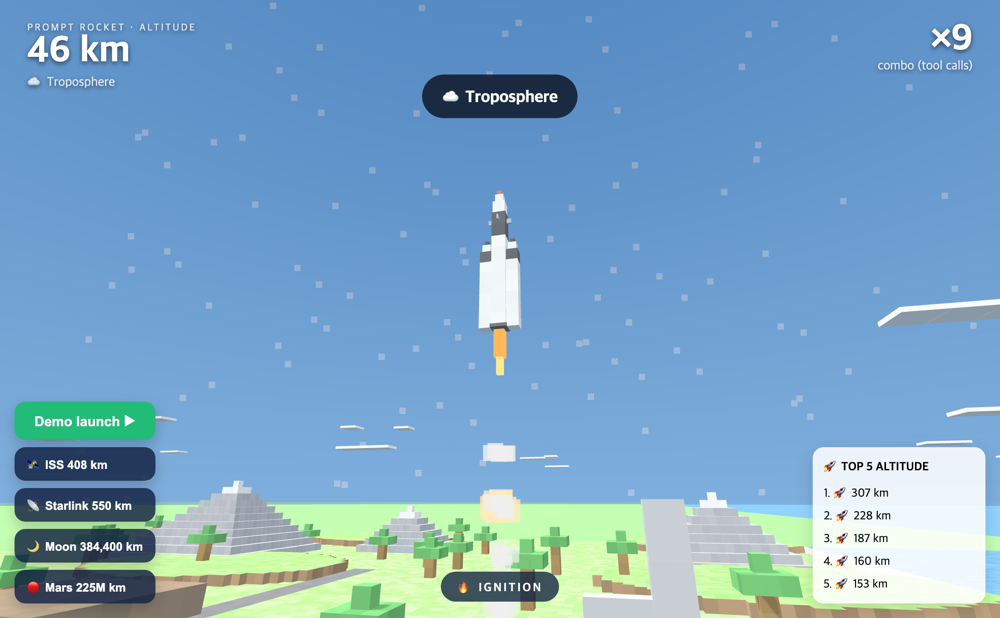

# Prompt Rocket 🚀

[](https://github.com/oh-namgyu/prompt-rocket/actions/workflows/ci.yml)
[](LICENSE)
[](https://github.com/oh-namgyu/prompt-rocket/releases)

> **한글 요약** — 브라우저에서 즐기는 복셀 로켓 발사 토이입니다(Three.js) — 차지하고, 발사하고, 나만의 팔콘이 날아가는 걸 구경하세요.

A silly, delightful toy: **your AI coding session launches a Minecraft-style voxel
Falcon Heavy.** Every tool call the agent makes is engine thrust.



[**▶ Live demo**](https://oh-namgyu.github.io/prompt-rocket/) — the demo-launch
buttons run entirely in your browser (the optional leaderboard needs the local
server, and degrades gracefully without it).


Send a prompt → the rocket ignites on a voxel launch site (grass blocks, block
mountains, a town, a beach and a sea). Each tool use adds a combo and ~7 km of
altitude (accelerating). When the turn ends, the ending depends on the **real
altitude** you reached:

| Reached (real km) | Ending | ≈ combos needed |
|---|---|---|
| below GEO | retro-burn boostback → landing (pad RTLS, or droneship at sea past the Kármán line) | — |
| 35,786 km (GEO) | satellite deploy + landing | ~430 |
| 384,400 km (Moon) | transit → **powered landing on a voxel lunar surface** (craters, rocks) | ~1,460 |
| 225,000,000 km (Mars) | transit → powered landing on voxel Mars (dunes, craters) | ~35,800 |

The altimeter counts real kilometers; zones toast as you pass them (troposphere,
stratosphere, Kármán line, ISS orbit 408 km, Starlink orbit 550 km, GEO). The
rocket shrinks as it leaves the atmosphere and Earth shrinks into a marble on a
log curve of distance, so the scales stay believable. As you climb, the sky
fades to space and square pixel stars come out.

Demo buttons (bottom-left) fly the scenarios without an agent: **ISS 408 km ·
Starlink 550 km (deploys a 6-sat train) · Moon · Mars**. Demo flights show the
combo count a real flight would need, and are excluded from the leaderboard.

> Built with [Claude Code](https://claude.com/claude-code) hooks. Zero runtime
> dependencies (Node's stdlib + a vendored Three.js). All graphics are
> procedural voxel geometry — no models, no textures. Local-only, binds to
> `127.0.0.1`.

## How it works

```
Claude Code session
  └ settings.json hooks (each no-ops instantly unless ~/.glide-armed exists)
      UserPromptSubmit → POST {type:start}  → ignition
      PostToolUse      → POST {type:combo}  → thrust (+altitude)
      Stop             → POST {type:end}    → ending by altitude → landing
  └ local event server (Node, :6030)
      GET /            → the 3D page
      GET /events      → SSE stream pushed to the browser
      POST /event      → receives activity, broadcasts over SSE, records scores
  └ browser (Three.js) renders the flight in real time
```

`POST /event {"type":"demo","target":"moon"}` triggers a themed demo externally
(targets: `iss` / `starlink` / `moon` / `mars`).

The hooks are **armed/disarmed by a flag file** (`~/.glide-armed`), so they have
zero effect on your normal sessions until you explicitly turn the game on.

## Quick start

Requires Node 18+ and a `curl` available on PATH.

```bash
node server.js                 # serves http://127.0.0.1:6030  (set PORT=xxxx to change)
./glide on                     # arm + open the browser
./glide off                    # disarm when you're done
```

`./glide status` reports server + armed state.

### Wiring the Claude Code hooks (one-time)

Add these to `~/.claude/settings.json` (merge with any existing `hooks`). Each is
gated on the arm flag, so they do nothing until `./glide on`:

```jsonc
{
  "hooks": {
    "UserPromptSubmit": [{ "hooks": [{ "type": "command",
      "command": "[ -f \"$HOME/.glide-armed\" ] && curl -s -m 1 -X POST http://127.0.0.1:6030/event -H 'Content-Type: application/json' -d '{\"type\":\"start\"}' >/dev/null 2>&1; exit 0" }] }],
    "PostToolUse": [{ "matcher": "*", "hooks": [{ "type": "command",
      "command": "[ -f \"$HOME/.glide-armed\" ] && curl -s -m 1 -X POST http://127.0.0.1:6030/event -H 'Content-Type: application/json' -d '{\"type\":\"combo\"}' >/dev/null 2>&1; exit 0" }] }],
    "Stop": [{ "hooks": [{ "type": "command",
      "command": "[ -f \"$HOME/.glide-armed\" ] && curl -s -m 1 -X POST http://127.0.0.1:6030/event -H 'Content-Type: application/json' -d '{\"type\":\"end\"}' >/dev/null 2>&1; exit 0" }] }]
  }
}
```

No Claude Code? You can still play: the demo buttons replay scripted flights
through the same event path.

## Layout

| File | Role |
|---|---|
| `server.js` | zero-dep Node event server (static + SSE + leaderboard) |
| `public/app.js` | flight physics, phases (climb/transit/descent), HUD, SSE wiring |
| `public/voxel.js` | merged-BufferGeometry voxel builders (Falcon, world, planets, surfaces, stars) |
| `public/index.html` / `style.css` | page + global styles |
| `glide` | arm/disarm helper |

## Notes

- **Why merged geometry instead of InstancedMesh?** Safari (ANGLE/Metal) renders
  nothing for instanced draws with the vendored Three build — scenery is baked
  into one merged BufferGeometry per group instead (also fewer draw calls).
- Leaderboard lives in `data/leaderboard.json` (runtime, git-ignored).

## License

MIT — see [LICENSE](LICENSE). Security policy: [SECURITY.md](SECURITY.md).
Bundles [Three.js](https://threejs.org) (MIT).
